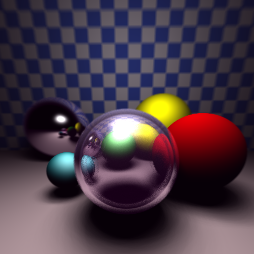

# rayden.py
Rayden - Simple Python Ray Tracing

## Features
- **Geometry**: Sphere, Plane, Triangle, Torus
- **Light**: Point, Area (rectangle)
- **Material**: Diffuse, Specular, Mirror, Glass, Checkerboard, Procedural Textures, Normal Map
- **Distributed Ray Tracing**: samples per pixel and shadow
- **Depth of Field**: depth and dispersion setup
- Scene description from JSON file
- Using *numpy* and *multiprocessing*.
- FQS - Fast Quartic and Cubic solver (https://github.com/NKrvavica/fqs) for computing roots of a quartic equation (torus intersection)

## Usage
```
rayden.py --help
usage: rayden [-h] --scene SCENE --output OUTPUT [--samplesPerPixel SPIXEL] [--samplesPerShadow SSHADOW]
              [--depthComplexity DEPTHCOMPLEXITY] [--dispersion DISPERSION] [--phong]

Rayden - Simple Python Ray Tracing

optional arguments:
  -h, --help            show this help message and exit
  --scene SCENE, -s SCENE
                        Scene description file
  --output OUTPUT, -o OUTPUT
                        Output file
  --samplesPerPixel SPIXEL, -sp SPIXEL
                        Samples per pixel
  --samplesPerShadow SSHADOW, -ss SSHADOW
                        Samples per shadow
  --depthComplexity DEPTHCOMPLEXITY, -dp DEPTHCOMPLEXITY
                        Depth complexity (depth of field)
  --dispersion DISPERSION, -dis DISPERSION
                        Dispersion (depth of field)
  --phong               Use classical Phong for specular component. Blinn-Phong, otherwise.
```

## Examples                                                 
```
rayden.py -s ./scenes/red-sphere.json -o ./results/red-sphere.png
```


```
rayden.py -s ./scenes/red-sphere-shadow.json
```


```
rayden.py -s ./scenes/hello-rayden.json
```


```
rayden.py -s ./scenes/hello-rayden.json --samplesPerPixel 4
```


```
rayden.py -s ./scenes/hello-rayden.json --samplesPerPixel 16
```


```
rayden.py -s ./scenes/hello-rayden.json --samplesPerPixel 16 --samplesPerShadow 4
```


```
rayden.py -s ./scenes/hello-rayden.json --samplesPerPixel 16 --samplesPerShadow 4 --depthComplexity 8
```


```
rayden.py -s ./scenes/hello-rayden.json --samplesPerPixel 16 --samplesPerShadow 4 --depthComplexity 8 --dispersion 10
```


```
rayden.py -s ./scenes/hello-rayden.json --samplesPerPixel 16 --samplesPerShadow 4 --depthComplexity 8 --dispersion 16
```


```
rayden.py -s ./scenes/pyramid.json
```


```
rayden.py -s ./scenes/torus.json
```


```
rayden.py -s ./scenes/torus-mirror.json
```


```
rayden.py -s ./scenes/torus-glass.json
```


